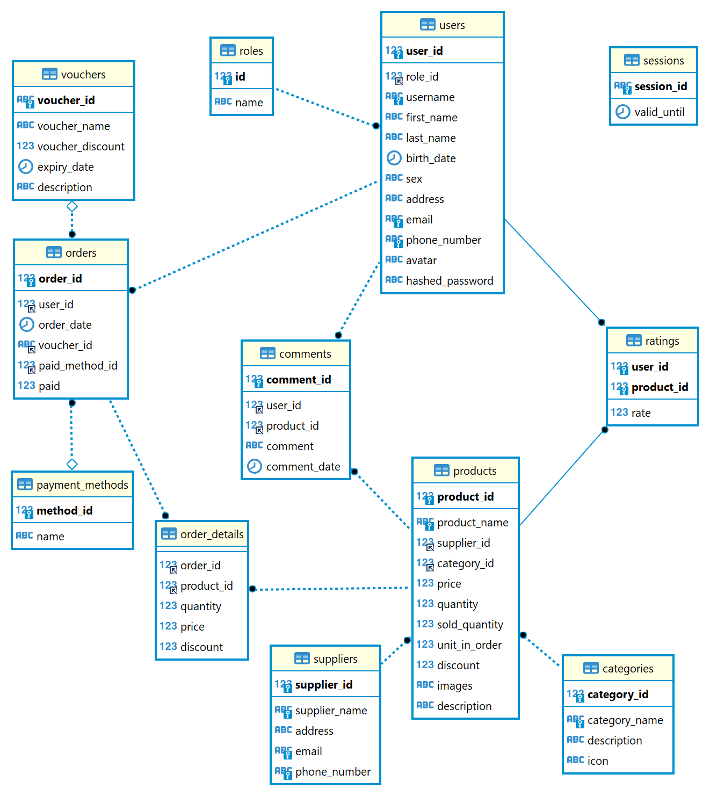

# E-commerce

## Prerequisites

- Nodejs v 18.11.0 or later (yarn or npm)
- MySQL

## Installation

- `git clone https://github.com/HOAIAN2/e-commerce.git`
- `cd e-commerce`
- Change permission on Linux: `chmod +x ./prepare.sh` `chmod +x ./build.sh`
- Run `prepare.bat` or `prepare.sh` to generate .env file and install libs for server and client.
- Restore database in `./database/db_backup.sql`

[Banner from freepik](https://www.freepik.com/free-vector/mega-sale-banner-your-online-store-realistic-style-with-phone-map-cart-bag-gift-vector-illustration_21869797.htm#query=online%20shop%20banner&position=30&from_view=keyword&track=ais)

## Build

- Run `build.bat` or `build.sh` to build ReactJS and start server

## Database Diagram

## API docs and preview

