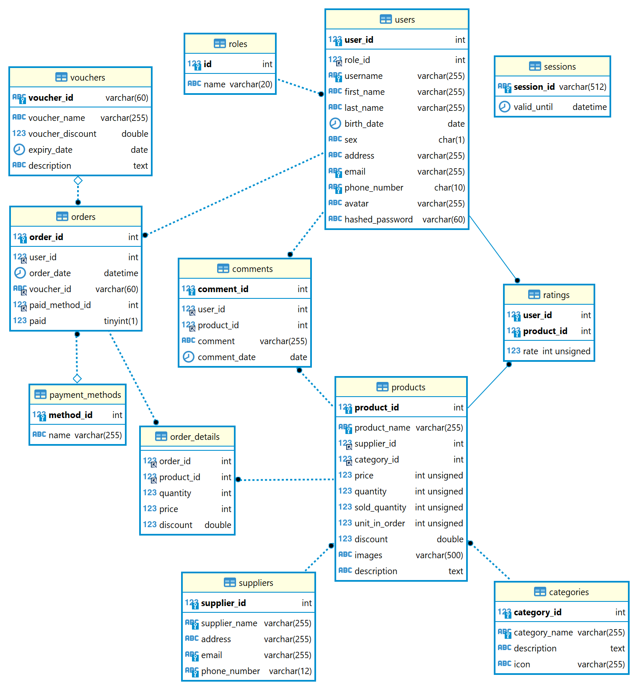

# E-commerce

## Prerequisites

- Nodejs v 18.11.0 or later (yarn or npm)
- MySQL

## Installation

- `git clone https://github.com/HOAIAN2/e-commerce.git`
- `cd e-commerce`
- Run `prepare.bat` or `prepare.sh` to generate .env file and install libs for server and client.
- Restore database in `./database/db_backup.sql`

- `yarn start` or `npm start`

## Build

- Run `build.bat` or `build.sh` to build ReactJS and start server

## Database Diagram

## API docs

